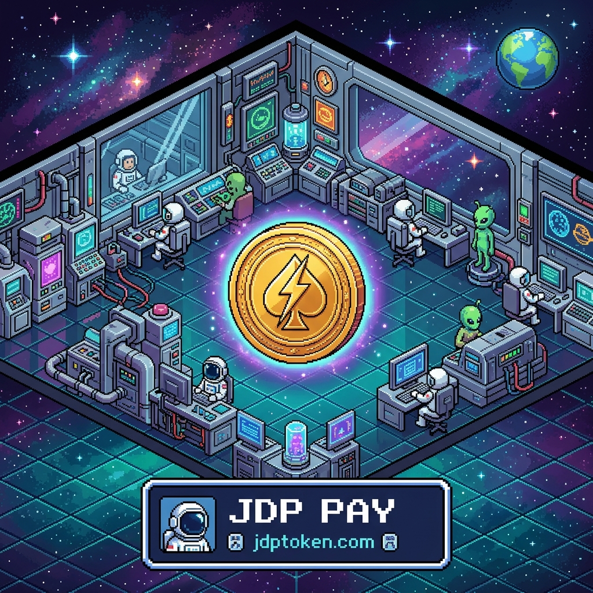

  

<h1 align="center">JDP — JD Productions Token</h1>

<strong>Creativity is the new resource. JDP is the fuel.</strong>

  
  
  
  

---

## The Vision

JDP is the utility token powering the **JDP creative civilization** on the Base network — fueling products, accessing premium tools, and enabling zero-friction transactions for the creative age.

Gold. Diamonds. Oil. Gems. These are what civilization called valuable. In the digital age, **creativity is the new resource — and JDP is the fuel.**

This repository holds the **public, verifiable smart-contract source** for the live JDP token. Read it. Verify it. That's the point.

---

## Contract

| | |
|---|---|
| **Token** | JD Productions Token (JDP) |
| **Address** | `0x1d442F1CfCe1C08193d529aC07Db72E02C30DfB3` |
| **Network** | Base Mainnet — Chain ID `8453` |
| **Standard** | ERC-20 (OpenZeppelin) |
| **Total Supply** | 100,000,000 JDP (fixed — no mint function) |
| **Burn** | 0.5% auto-burn per transfer (hard-capped at 2%, true supply reduction) |
| **Launch protection** | Anti-bot max-tx / max-wallet caps + trading gate (removable) |
| **Explorer** | [View on BaseScan »](https://basescan.org/token/0x1d442F1CfCe1C08193d529aC07Db72E02C30DfB3) |

---

## Files

| File | Purpose |
|---|---|
| [`JDP_TOKEN_V2.sol`](JDP_TOKEN_V2.sol) | The live JDP token — ERC-20, burn-to-use, launch-armored |
| [`JDP_VESTING_CONTRACT.sol`](JDP_VESTING_CONTRACT.sol) | Founder vesting — 3-year linear, 12-month cliff |

---

## Design Principles

- **Decentralized utility currency** — value comes from *use*, not from selling.
- **Burn-to-use** — every transaction permanently reduces supply. Scarcity grows with adoption.
- **Bounded, transparent control** — owner powers are capped (burn can never exceed 2%) and exercised in the open.
- **Founder vesting** — the creator's allocation is locked on a public schedule, never dumped.

---

## Litepaper
Read the [JDP Litepaper](LITEPAPER.md) — participation thesis, tokenomics, security, and roadmap.

## Wallet Transparency
All allocations live in public multisig Safes, a vesting contract, or the liquidity pool — see [TRANSPARENCY.md](TRANSPARENCY.md) for every address and label.

## Links

- 🌐 Website — [jdptoken.com](https://jdptoken.com)
- 𝕏 — [@jdpcoin](https://twitter.com/jdpcoin)
- 💬 Discord — [Join the civilization](https://discord.gg/GEvDhqDTY)

---

<strong>Disclaimer:</strong> JDP is a utility token. Not a security. Not investment advice. The value of JDP may increase or decrease. Do not allocate funds you cannot afford to lose. Built by JD Productions / JD AI Systems.
